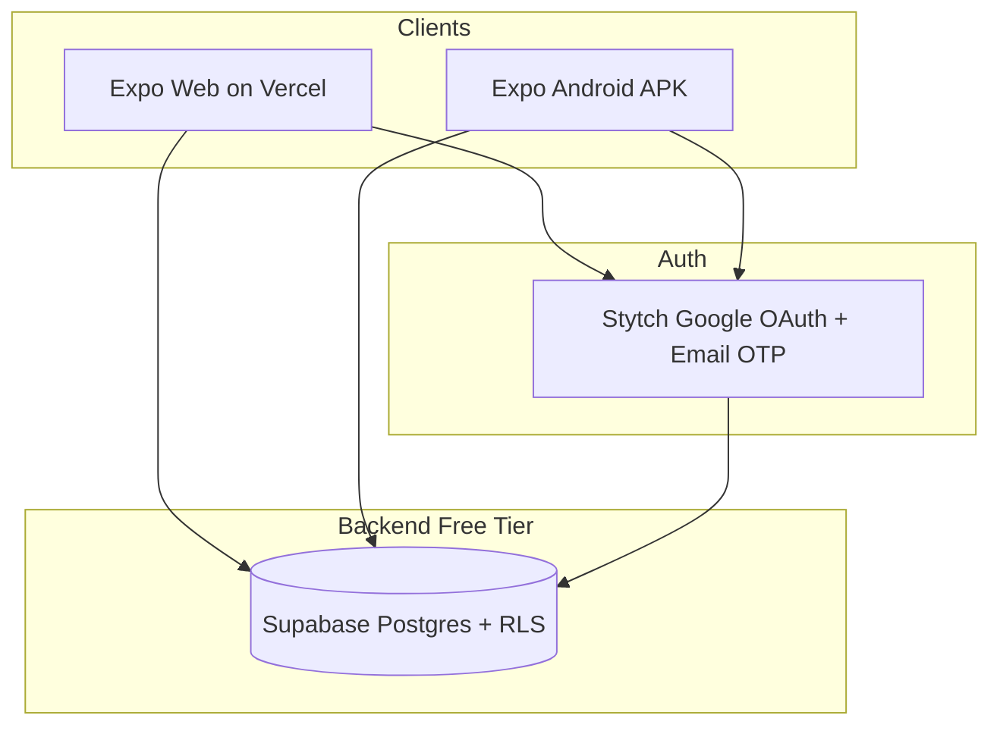
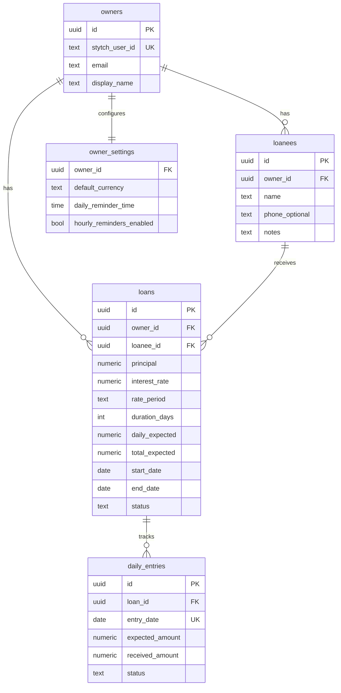
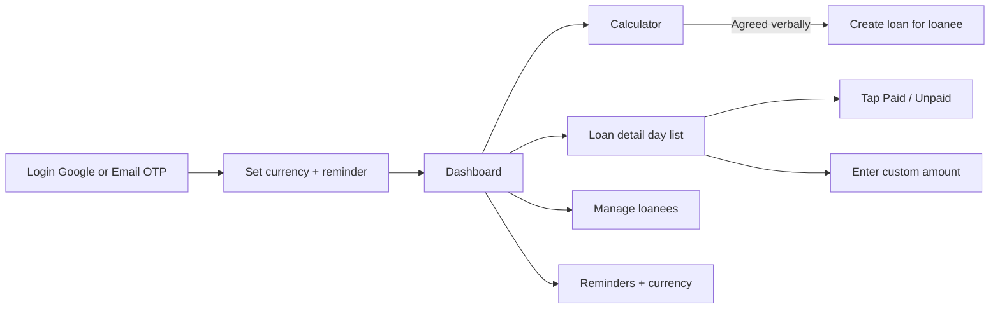

# LendLedger — Design Plan

## Confirmed decisions (v1)

| Decision | Choice |
|----------|--------|
| **App name** | **LendLedger** |
| **Stack** | **Expo** (web + Android) + **Supabase** (Postgres/RLS) + **Stytch** (auth) |
| **Auth** | **Google OAuth** primary; **email OTP** fallback; **no SMS OTP in v1** (avoids per-SMS cost) |
| **Hosting / URLs** | **No purchased domain** — `lendledger.vercel.app` + Android deep link `lendledger://auth/callback` |
| **Stytch custom domain** | **Deferred** — not needed for launch |
| **Android delivery** | Native via **Expo** (reliable local reminders; Play Store via EAS) |
| **Infrastructure cost goal** | **$0 recurring** for v1 (except optional $25 one-time Play Store fee) |

---

## Confirmed requirements (from discovery)

- **Interest model:** Flat/simple interest — `totalInterest = principal × rate × durationDays` (rate normalized to daily), `dailyPayment = (principal + totalInterest) ÷ durationDays`. Example: 100 INR, 1%/day, 50 days → 3 INR/day.
- **Loan lifecycle:** Extendable — owner can extend term or roll unpaid/partial days forward.
- **Currency:** One default currency per owner account; all loans use it in v1.
- **Android:** Native via Expo (single codebase with web; local notifications for reminders).
- **Reminders:** Global daily default (e.g. evening); optional hourly reminders in settings.
- **Audience:** Owner-only; no loanee login, notifications, or portal in v1.

---

## Confirmed architecture

Single TypeScript codebase: **Expo** targeting **web (React Native Web)** and **Android**, backed by **Supabase** and **Stytch**.



**Why this stack:** One UI codebase; $0 hosting/database/auth on free tiers; Expo local notifications on Android; Supabase RLS isolates each owner's data.

**Deferred alternatives:** Next.js + Capacitor (better web polish), Flutter (strong mobile, weaker web), SMS OTP (cost), custom domain (branding only).

---

## Free-tier infrastructure map

| Concern | Service | Free tier notes |
|---------|---------|-----------------|
| Database | [Supabase](https://supabase.com) Postgres | 500 MB, 50K MAU auth if using Supabase auth helpers; we use Stytch for auth, Supabase for data only |
| Auth | [Stytch](https://stytch.com) | Google OAuth + email OTP only in v1; Stytch Test → Live when shipping |
| Web hosting | Expo static export → **Vercel** | Free `lendledger.vercel.app` subdomain |
| Android builds | Expo EAS | Limited free builds/month; local `eas build` alternative |
| Push/local reminders | Expo Notifications | Local scheduled notifications (no paid FCM required for local) |
| File storage | Not needed v1 | Skip |
| **Domain / URLs** | **No purchase required** | See zero-cost URL strategy below |

**Auth flow:**
1. User signs in via **Google OAuth** (primary button) or **email OTP** (fallback link)
2. Stytch returns session → app upserts `owners` row keyed on `stytch_user_id`
3. Supabase client uses Stytch JWT (custom claim or service role pattern) → RLS scopes all queries to `owner_id`
4. **SMS OTP:** out of scope for v1; add later if needed with budget for per-SMS fees

### Zero-cost URLs (no custom domain purchase)

A **purchased custom domain is optional** and not required for Stytch, hosting, or v1 launch.

| Use case | Free URL to use | Notes |
|----------|-----------------|-------|
| Web app (production) | `https://lendledger.vercel.app` or `https://lendledger.netlify.app` | Auto-provided by free hosting; stable enough for Stytch redirect allowlist |
| Web app (local dev) | `http://localhost:8081` (Expo web) or `http://localhost:3000` | Stytch Test project defaults support localhost |
| Stytch post-login redirect | `https://lendledger.vercel.app/auth/callback` | Add to Stytch Dashboard → Redirect URLs |
| Google OAuth callback | `https://test.stytch.com/v1/oauth/callback/...` | Stytch-owned; authorize `stytch.com` in Google Cloud — **not your domain** |
| Android Google OAuth | App deep link e.g. `lendledger://auth/callback` via Expo AuthSession | No web domain needed on device |
| Android OTP login | In-app Stytch SDK / API | No domain needed |
| Stytch custom auth domain | **Skip for v1** | Paid DNS + branding only; defer until revenue justifies it |

**Practical v1 setup:** Deploy web to Vercel (free subdomain) → register that exact callback URL in Stytch → use Expo deep links on Android. Users access the app via the free subdomain or Play Store install; they never need a branded `.com`.

**Costs that are not zero (accepted / optional):**
- Google Play Developer account: **$25 one-time** (only if publishing to Play Store; sideload APK remains free for personal use)
- Supabase / Stytch / Vercel free tiers have usage caps — sufficient for early SMB owner usage
- Custom domain + Stytch custom auth domain: **deferred** until revenue justifies ~$10–15/year

---

## Core data model



**Rate/duration normalization (calculator + loan creation):**
- User selects rate period: day (default) | month | year
- User selects duration unit: days (default) | months | years
- Convert everything to `durationDays` and `dailyRate` internally before computing `daily_expected`
- Store computed `daily_expected` and `total_expected` on the loan row (immutable snapshot at creation; extensions create adjustment records)

**Daily entry statuses:** `paid` | `unpaid` | `partial` (when custom amount ≠ expected)

**Loan statuses:** `active` | `extended` | `closed`

**Extension behavior (v1):**
- Owner action: "Extend loan" — adds N days, recalculates remaining balance (unpaid days + outstanding principal/interest per business rule)
- Simple v1 rule: unpaid days remain marked unpaid; extension adds new daily entries at same `daily_expected` until outstanding total is recovered (owner confirms new end date + optional revised daily amount)

---

## Key screens and UX flow



### 1. Login / onboarding
- **Primary:** "Continue with Google" (Stytch Google OAuth)
- **Fallback:** "Sign in with email" → Stytch email OTP (6-digit code, no password)
- **Not in v1:** SMS OTP (cost), phone login
- First-run: pick default currency (INR default suggestion), set daily reminder time

### 2. Dashboard (home)
- **Summary cards:** Total loaned (principal) | Total received | Outstanding | Active loans count
- **Charts:**
  - Donut: principal outstanding by loanee
  - Bar: expected vs received this week
  - Line: cumulative collections over last 30 days
- **Quick actions:** New calculation, Add loanee

### 3. Calculator → Create loan
- Inputs: amount, interest rate, rate period dropdown, duration + unit dropdown
- Live output: daily payment, total repayable, total interest
- CTA: "Save as loan" → pick/create loanee → confirm → creates loan + generates `daily_entries` for each day from `start_date`

### 4. Loan detail
- Header: loanee name, principal, daily expected, progress bar (days paid / total days)
- **Day list** (scrollable, today pinned): each row shows date, expected, Paid / Unpaid toggle
- Tap row → optional custom amount sheet
- Actions: Extend loan | Close loan (when fully settled)

### 5. Loanees
- Simple list + add/edit (name, optional phone/notes)
- Tap loanee → their active/past loans

### 6. Settings
- Default currency (locked if active loans exist — warn before change)
- Daily reminder time (default e.g. 7:00 PM)
- Toggle hourly reminders (optional, v1 can schedule 1–3 slots rather than true hourly to save battery)
- Sign out

---

## Reminder system (v1)

- **Default:** one local notification daily at configured time: "Update today's collections in LendLedger"
- **Optional hourly:** when enabled, repeat during owner-defined window (e.g. 9 AM–6 PM) — implemented as local scheduled notifications on Android; web uses Browser Notification API where permitted (graceful fallback: in-app badge only)
- Reminders are **global**, not per-loanee (per your v1 simplicity choice)
- No loanee-facing alerts in v1

---

## Error handling and edge cases

| Case | Behavior |
|------|----------|
| Custom amount > expected | Allow; show overpayment credit on loan summary |
| Custom amount < expected | Mark `partial`; outstanding shown on loan header |
| Missed logging for past days | Owner can backfill any past day on loan detail |
| Edit loan terms mid-flight | v1: use "Extend loan" only; no silent recalculation of past entries |
| Delete loanee with active loans | Block delete; require close/transfer first |
| Offline Android | Read cache + queue writes (Expo + Supabase offline queue or optimistic UI with sync on reconnect) — **stretch for v1**, at minimum show offline banner |

---

## Testing strategy

- **Unit tests:** interest normalization + daily payment calculator (pure functions)
- **Integration:** loan creation generates correct number of `daily_entries`
- **Manual smoke:** login → calculate → create loan → mark paid/partial → dashboard totals update → extend loan

---

## Out of scope (v1)

- Loanee app, login, or payment reminders to loanees
- Payment gateway / actual money movement
- Multi-user staff accounts
- Per-loan currency or FX conversion on dashboard
- Export/PDF reports (nice v1.1)
- SMS OTP via Stytch (add when budget allows)
- Stytch custom auth domain / purchased `.com` domain (branding polish)
- iOS (future: Expo makes this cheap)

---

## Proposed project structure (greenfield)

```
lendledger/
├── apps/
│   └── mobile/          # Expo app (web + android)
├── packages/
│   └── core/            # calculator, date/rate normalization, types
├── supabase/
│   ├── migrations/
│   └── seed.sql
└── docs/superpowers/specs/
    └── 2026-05-25-lendledger-design.md   # written after plan approval
```

---

## Implementation phases (high level)

1. **Foundation** — Expo app scaffold, Supabase schema + RLS, Stytch Google + email OTP, Vercel deploy + redirect URLs
2. **Calculator + loan CRUD** — core math package, create loanee/loan, generate daily entries
3. **Daily tracking UI** — paid/unpaid/partial with dashboard aggregation
4. **Dashboard charts** — summary metrics + 2–3 charts
5. **Reminders** — settings + local notifications (Android priority)
6. **Extend loan flow** — extension UX + data migration
7. **Polish + Play Store** — onboarding, empty states, EAS Android build
